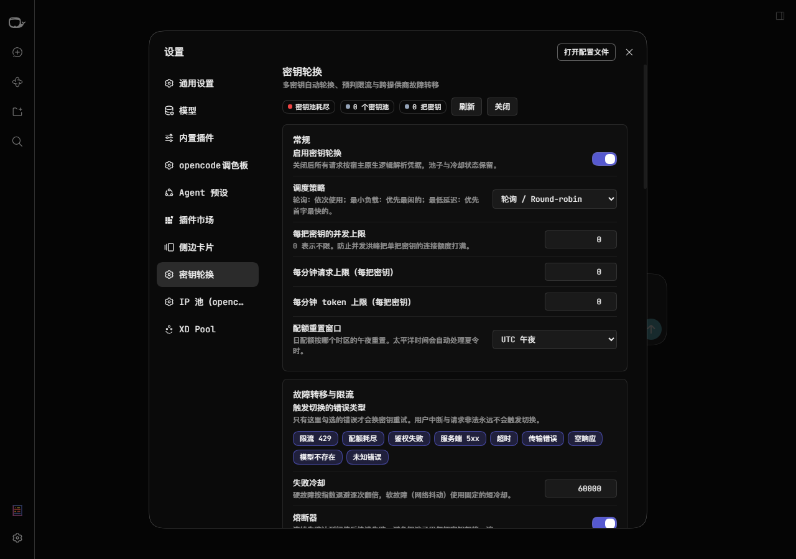
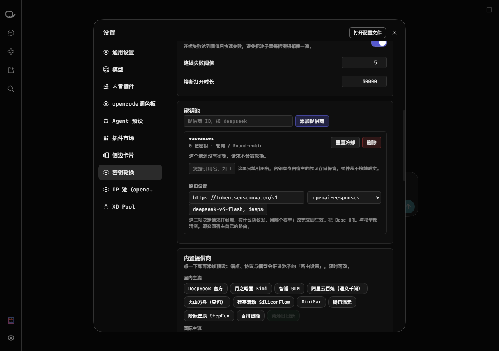
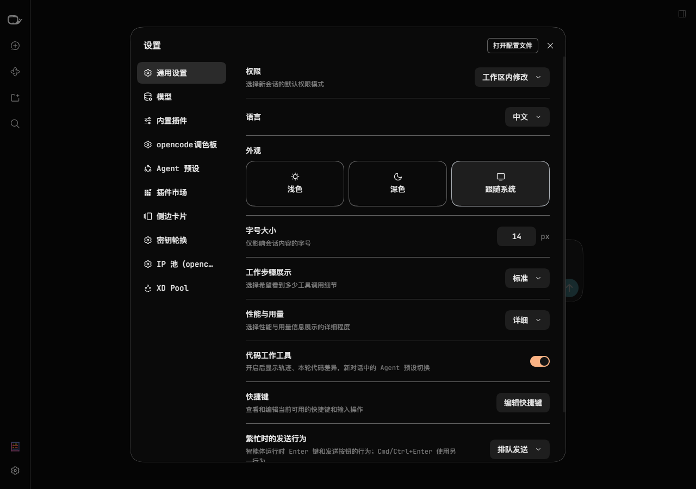

# dsh-keypilot

> 适用于 DeepSeek Harness 的企业级**无感 API 密钥轮换、预判限流与跨提供商故障转移**引擎。

多把密钥自动轮换、在 429 之前就跳过已经饱和的密钥、密钥全挂时级联到备用提供商，
并且**设置面板直接接进系统设置**的左侧导航。

---

## 它解决什么问题

高吞吐场景下（长任务、多子智能体并行、密集的工具调用），单个密钥很容易撞上上游的
速率限制：HTTP 429、RPM/TPM 耗尽、每日配额用尽。在原生 DSH 里，一次 429 会让整个
agent 回合失败——丢掉已经产生的 token，打断会话的可重放性，需要人工重来。

dsh-keypilot 在**凭据解析**这一处换手：请求发出去之前由密钥池决定用哪把密钥，
失败且还没吐出内容时换下一把重来。

```
用户消息 → llm/stream
              │
              ▼
        ┌─────────────┐   饱和/并发满
        │  密钥池选择  │ ──────────────► 跳过该密钥
        └──────┬──────┘
               │ 可用
               ▼
      credentials.resolve(ref)  ──►  换成这次该用的那一把
               │
               ▼
        上游 API  ──429/5xx──► 分类 → 冷却 → 换下一把重试
               │
               └─ 全部耗尽 ──► 跨提供商级联
```

**提供商身份自始至终不变**，因此多轮会话、工具状态与可重放性完全不受影响。

---

## 设置面板长这样



注意它接进的是**系统设置左侧导航的一级分区**（截图里高亮的「密钥轮换」），
而不是「设置 → 插件」二级页里的一张卡片。

密钥池里每个池子都带一块**路由设置**——端点、线上协议、模型都能原地改，
改完立即重新注册路由：



（图中那个「0 把密钥」的池子，引用名还没填；引用名不是密钥本体，见下面的「密钥放在哪」。）

---

## 功能

| 分类 | 能力 |
|---|---|
| **透明轮换** | 每提供商一个密钥池；失败自动换下一把；首字之前零丢失重试 |
| **预判限流** | 本地 RPM/TPM 令牌桶，发请求前跳过已饱和的密钥；支持上游 `x-ratelimit-*` 响应头自适应 |
| **并发控制** | 每把密钥的在飞请求上限，含超时兜底回收（防计数泄漏） |
| **智能调度** | `round-robin` 轮询 / `least-loaded` 最小负载 / `lowest-latency` 最低首字延迟（p95） |
| **分级退避** | 硬故障指数退避（逐次翻倍封顶 ×8）、软故障固定短冷却、±12.5% 抖动、惩罚衰减 |
| **熔断器** | 连续失败达阈值后快速失败，半开探测自动恢复 |
| **跨提供商级联** | 主池全冷却时按声明顺序级联，带深度与环路防护 |
| **内置提供商目录** | 近 30 条常用服务商预设（DeepSeek、OpenAI、Anthropic、Gemini、Kimi、GLM、通义、豆包、商汤日日新、NVIDIA NIM、OpenRouter、Ollama…），一键加入 |
| **自定义提供商** | 宿主不认识的网关，声明式注册真正的 pi-ai 模型路由 |
| **配额窗口** | UTC / 太平洋时间（自动处理夏令时）/ 本地时区午夜 / 滚动 24 小时 |
| **金丝雀探测** | 对冷却中的密钥发一次免费的 `/models` 探活：成功即提前归队，仍在限流的继续等，鉴权失败的直接长期隔离 |
| **用量报表** | 按日 / 提供商 / 密钥统计请求、token 与估算成本；CSV / JSON 导出；过期日期桶自动裁剪 |
| **Webhook 通知** | Telegram / Discord / Slack 或任意 HTTP 端点；有界队列 + 5 秒聚合（防告警风暴）+ 失败指数退避 |
| **设置面板** | 接进**系统设置左侧导航**的一级分区：池健康、密钥状态、冷却倒计时、实时事件流 |
| **面板直填密钥** | 在密钥池里填引用名 + 粘贴密钥值，经宿主的公开接口 `credentials.set` 写进凭据存储；插件配置里仍只留引用名，且值不进日志 |
| **安全** | 配置只存凭据引用名；密钥本体误贴会被拒绝；设置桥 Fail-Closed 环回同源校验 |

---

## 安装

### DSH Desktop

桌面版的 `desktop` profile 由 Electron 应用独占管理，请通过应用内的**插件管理器 / 插件市场**
安装，或在桌面端的插件页面里选择「从本地目录安装」并指向本仓库根目录。

### Web / CLI profile

```bash
dsh plugin --profile web add link:/path/to/dsh-keypilot
```

本地开发时也可以用 patch 覆盖层，**不改动 profile 的插件清单**：

```yaml
# local.cordis.yml
- insert:
    - id: keypilot
      name: '@sucooer/dsh-keypilot'
```

```bash
dsh web --profile web --patch ./local.cordis.yml
```

装好后打开 **设置 → 密钥轮换**。

---

## 配置

设置面板能改的都会立刻生效，无需重启。也可以直接写在 profile 的插件配置里：

```yaml
keypilot:
  enabled: true
  cooldownMs: 60000
  maxCooldownMs: 0            # 0 = 用 cooldownMs × 8
  concurrencyLimit: 5         # 0 = 不限
  routingStrategy: round-robin
  circuitBreakerEnabled: true
  circuitBreakerThreshold: 5
  circuitBreakerOpenMs: 30000
  quotaResetWindow:
    type: midnight_utc        # midnight_utc | midnight_pst | midnight_local | rolling_24h
  switchKinds:                # 只有这些错误才换密钥
    - RATE_LIMIT
    - QUOTA
    - AUTH
    - SERVER
    - TIMEOUT
    - TRANSPORT
    - EMPTY_RESPONSE
    - UNKNOWN_MODEL
  cascade:                    # 主池耗尽后的备用提供商
    - provider: openrouter
      model: deepseek/deepseek-chat
  providers:
    - provider: deepseek
      keys:                   # ← 只填凭据引用名，不填密钥本身
        - DEEPSEEK_API_KEY
        - DEEPSEEK_API_KEY_2
      rpmLimit: 60
      tpmLimit: 100000
    - provider: my-gateway    # ← 宿主不认识的网关
      keys: [MY_GW_KEY]
      route:
        id: my-gateway
        displayName: 我的网关
        baseURL: https://gw.example.com/v1
        api: openai-completions
        models: [gpt-4o, claude-sonnet-4-5]
```

### 密钥放在哪

插件的配置里**永远只有引用名**（如 `SENSENOVA_API_KEY`），真实密钥由宿主的凭据服务保管
（桌面端是 `%APPDATA%\dsh-desktop\harness\.credentials.yaml`）。

填密钥有两条路。

**① 宿主的「设置 → 模型」页**——宿主自己的入口：



在那里添加/编辑一个模型提供商时填入 API Key，宿主会把值存进凭据存储，并按下式自动
派生引用名：

```
<提供商名转大写、非字母数字换成下划线>_API_KEY     # sensenova → SENSENOVA_API_KEY
```

本插件的「密钥池」里填**同一个名字**就能接管它的解析。

**② 本插件「密钥池」里的「直接填密钥」**——填引用名 + 粘贴密钥值，点「写入并加入池子」：
密钥值经宿主的公开接口 `credentials.set` 写进凭据存储，插件配置里仍然只留引用名，
明文不落进插件配置。

需要 ② 的原因是：宿主的「模型」页**一个提供商只有一个 key 字段**，而轮换需要多把密钥。
在 ② 里继续加 `SENSENOVA_API_KEY_2`、`_3` 就行，不用去翻凭据文件。

（插件配置里那个只有引用名的输入框，以及「直接填密钥」的名字栏，都只接受**名字**：
把密钥本体粘进去会被拒绝——否则明文就进了磁盘上的插件配置，而用户以为只是填了个名字。）

---

## 架构

```
lib/core/            纯逻辑层：不依赖任何宿主服务、不做 I/O，可完整单测
  provider-catalog.js  内置提供商目录
  route-schema.js      路由声明校验与归一化
  token-bucket.js      RPM/TPM 账本 + 响应头自适应
  concurrency.js       并发槽位（含泄漏兜底回收）
  backoff.js           退避、抖动、惩罚衰减、熔断器
  classify.js          错误分类（决定该不该换密钥）
  quota-window.js      配额重置窗口（时区正确）
  pool.js              密钥池与调度策略
  cascade.js           跨提供商级联（防递归）
  histogram.js         首字延迟百分位
  estimate.js          token 预估
  redact.js            脱敏与密钥形态识别

lib/runtime/         宿主接缝层：唯一与 DSH 接触的部分
  rotate.js            轮换引擎（凭据绑定、安全重试点、级联）
  custom-routes.js     pi-ai 适配器注册与撤回
  config.js            配置归一化与持久化
  state.js             健康状态持久化（原子写）
  http-bridge.js       设置桥（Fail-Closed 环回同源）

lib/index.js         host 装配    lib/client.js  设置面板（浏览器端）
```

分层的意义：**判定逻辑可以脱离 DSH 完整测试**，宿主 API 变动时只有 `lib/runtime/` 需要跟着改。

### 几个刻意的设计选择

- **不做「一个密钥一条路由」**。同类实现常用克隆路由，那是路由撞车、孤儿路由与级联递归的
  主要来源，而对透明轮换毫无必要——路由不动、只换解析出的密钥即可。
- **轮询指针基于固定票序**，而不是「过滤后候选集」的下标。后者在候选集变化时（冷却、
  饱和、本次调用排除）会跳着选，用户看到的就不是「依次换过去」而是「随机乱跳」。
- **一旦吐出内容就不再重试**。否则用户会看到两段拼接起来的回答。
- **用户中断不是失败**。`finish.aborted` 与 `AbortError` 原样传递，按了停止就不会继续。

---

## 测试

```bash
node --test test/run.mjs      # 349 个用例
node tools/verify.mjs         # 打包自检（63 项）
```

覆盖重点：

- **路由声明校验**：非法 ID、相对路径、内嵌凭据、重复 ID、畸形输入
- **池选择**：冷却跳过、RPM 预判、并发饱和与「耗尽」的区分、三种调度策略、加权轮询
- **退避与熔断**：指数封顶、软故障不增长、`Retry-After` 不被本地上限压低、状态机全路径
- **错误分类矩阵**：状态码、gRPC 码、文本线索、中文关键词、中断优先于一切
- **配额窗口**：冬夏两季的太平洋时间（夏令时）、四种窗口类型
- **轮换引擎**：请求内凭据绑定、内容可见后不重试、中断不切换、级联防递归
- **金丝雀探测**：四种探测结果的处置表、探测上限与间隔、失败只能延长冷却不能缩短
- **用量账本**：按日/提供商/密钥聚合、过期裁剪、CSV 转义、同名密钥分属不同服务商不合并
- **Webhook**：平台识别、https 强制、载荷形状、队列聚合/有界/退避
- **成本估算**：具体条目优先于宽泛条目、用户覆盖优先、缓存读取折价
- **设置桥安全**：远程来源、DNS rebinding、跨站写、超大请求体、方法越权
- **配置层**：密钥本体被拒、数值夹取、优先级语义、旧格式兼容

测试抓出并修掉的真实缺陷（节选）：熔断器用 `openedAt === 0` 当哨兵导致时钟起点为 0 时状态失效；
`Retry-After` 被本地退避上限截断导致冷却未到就再撞一次；面板上改的全局设置被宿主配置盖掉；
轮询指针用过滤后数组下标导致重试时跳着选；`warnings` 诊断混进配置对象被一起落盘。

---

## 已知限制

- **只能轮换宿主已经认识的路由**。内置提供商由宿主的适配器决定；宿主不认识的网关需要
  在面板里声明自定义路由（依赖宿主的 pi-ai 接缝，宿主不提供时会在面板里给出诊断）。
- **预判限流是本地估计**。多个进程共用同一把密钥时，本地账本看不到别人的消耗；
  上游若返回 `x-ratelimit-remaining-*` 会以其为准。
- **不适用于 embedding / 批处理的重试**。这些调用会走池子选密钥，但不参与流式重试。

---

## 许可

MIT © [sucooer](https://github.com/sucooer)
